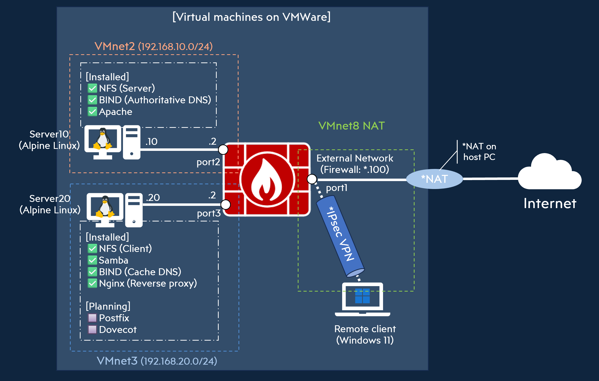

## 概要
- 企業ネットワークを模した環境をVMware Workstasion Pro上に構築しました。

## できること
- ネットワーク外のリモートクライアントからはIPSec VPN経由でアクセス可能。（FortiGate）
- リモートクライアント～LAN間のファイル共有・名前解決・Webサーバへのアクセスが可能。（NFS/Samba/DNS/Nginx/Apache）

## 構成図
!
